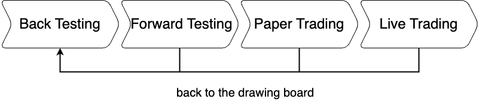

= The 4 Stages
:jbake-type: doc
:icons: font
:jbake-date: 2020-01-01

There are 4 distinct stages that you go through when you develop, test and run a new trading strategy. The below diagram shows the stages and the order in which they are executed:

Each stage has its own specific purpose and benefits. There are two important rules to adhere to:

. If possible at all, don't skip a stage. Every stage has its purpose in order to end up with a well performing and robust trading strategy.
. And perhaps more important, if you are not happy about the performance in a later stage, go back to the first stage. Often minor changes to the code can have major impact on the results and should be thoroughly tested at every stage.

Roboquant support all 4 stages and requires minimal changes to your code when you move from one stage to the next. Your strategy and policy should not change at all between stages, and only the selected data feeds and broker differ between stages.

The following table shows the used `Broker` and `Feed` in the different stage:

|===
|Stage |Broker |Feed

|Back Testing|SimBroker|Historic data feeds
|Live Testing|SimBroker|Live data feeds
|Paper Trading|Real broker using demo account|Live data feeds
|Live Trading|Real broker using live account|Live data feeds
|===

== Stage 1: Back Testing
In this stage you'll use *historic data* and the *SimBroker* to test your strategy and policy.

You can of course run a single back test over the complete timeline of historic data. But roboquant makes it easy to also run walk forward and randomly sampled time-frames. This gives you better insights into the performance under different regimes.

It is very important to get as many insights as possible about the overall performance and behavior, so you know what to expect and also what not expect when you finally will go live.

This is also the only stage where you should develop and modify your strategy and policy. If you are not happy with the performance at a later stage, you should return this first stage and make the changes there. If for example you would like to use circuit-breakers during live trading to get some extra peace of mind, you should already include this logic during back testing.

TIP: configure the SimBroker similar to the live trading account and broker you are going to use. Provide realistic cost and starting account balance, so you don't get a too optimistic outlook on the overall cost. In general is it preferable to be conservative and define a higher cost structure at this stage then the other way around.

== Stage 2: Live Testing
In this stage you use *live data* and the *SimBroker* to test your strategy and policy. The main purpose is to validate if your strategy is still performing well on unseen data.

It is very easy to over fit your strategy during back testing, and this stage provides some confirmation if that is the case. That being said, often you cannot run this stage for as long as required to have a perfect insight into over fitting, so this is an indication at best.

TIP: roboquant can use any combination of data feed and broker. So you don't need to restrict yourself to data feed from your broker. There might be better and/or cheaper alternatives available.

== Stage 3: Paper Trading
In this stage you use *live data* with a *paper trading or demo account* to test your strategy and policy. The main purpose is to validate if your policy is still performing well using a different broker implementation. For example, are the order generated by the policy fully supported and behave as expected.

This stage is where you validate the robustness of your approach and get extra confirmation that it is ready to go live. If you don't have a solid policy in place that handles all conditions, you should not go to the live trading stage.

TIP: this will only work if your broker offers decent paper trading simulation. But if you are serious about algo-trading, you should only settle on brokers that offer realistic paper trading functionality.

== Stage 4: Live Trading
In this stage you'll use *live data* and the *live trading account* to run your strategy and policy and now real money is at stake. And although we are not at a testing stage, you will need to closely monitor the performance and take appropriate actions. One reason is that even paper trading is a just simulation and cannot fully prepare for what will happen during live trading.

WARNING: it is easier than you think to create a solution that goes haywire and for example generates too many orders. If this happens, you can quickly lose all your money due to transaction- and other types of cost.

