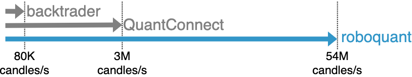

= History
:jbake-type: doc
:icons: font
:jbake-date: 2020-12-01

== Why develop a new platform
Before we started to develop _roboquant_, we looked at existing frameworks and platforms to see if these could fit the bill. What we quickly found out is that many of these frameworks take a very naive approach to algo-trading. For example, hardly any of the sample code available should ever be used in live trading since it doesn't address many of the edge cases.

For our use-cases none of them checked all the boxes that we required:

* [x] Have an engine that can handle large volumes of data and run extensive and realistic back-tests
* [x] Trade assets in multiple currencies at the same time
* [x] Support many asset classes including cryptocurrencies
* [x] Have solid live trading, including support for advanced order types and correctly handling of (async) order management
* [x] Support for trading in multiple markets in different regions at the same time

Some of these use-cases might be unique to our situation. But since we believe that others might also benefit from the platform we decided to open source it and make it available for free to everyone.

== Why use Kotlin
There are many computer languages available to choose from. After having developed several prototypes in different languages (Python, Julia and Kotlin), we decided to go with Kotlin. Kotlin is a popular programming language that was first introduced in 2011 by JetBrains. It is a versatile language that is designed to be compatible with Java and can be used for a wide range of applications, including financial software.

There are several reasons why Kotlin is particularly suitable for financial software in general and algo-trading software in particular:

* [x] *High-Level Language*: Kotlin is a high-level language that is easy to read and understand, making it an ideal choice for developers working on complex financial applications. It has a concise and clear syntax that allows developers to write code quickly and efficiently.
* [x] *Interoperability with Java*: Kotlin is interoperable with Java, which means that developers can use existing Java libraries and frameworks in their Kotlin projects. This feature is particularly useful in financial software development, where many existing libraries are written in Java.
* [x] *Type-Safety*: Kotlin is a type-safe language, which means that it provides strong type-checking during the compilation process. This helps to eliminate common errors and bugs that can occur in software development.
* [x] *Null-Safety*: Kotlin has built-in null-safety features that help to prevent null pointer exceptions. In algo-trading software, where even a small error can have significant consequences, null-safety is essential.
* [x] *Concise Code*: Kotlin's concise syntax allows developers to write code more efficiently, reducing the amount of boilerplate code required. This helps to improve productivity and reduce the risk of errors. And perhaps equally important, it makes developing software more fun.
* [x] *Strong Community Support*: Kotlin has a strong and growing community of developers who contribute to its development and offer support to others. This community provides a wealth of resources, including tutorials, libraries, and tools, making it easier for developers to create high-quality software.
* [x] *Fast Runtime*: Kotlin on a JVM is fast enough to handle even the largest data sets during back testing and allows for sub-millisecond market data processing. See also the xref:performance.adoc[performance page].
* [x] *Interactive Development*: You can use Kotlin in Jupyter Notebooks and interactively develop and test your trading strategies.

In conclusion, Kotlin is a versatile and powerful programming language that is well-suited for algo-trading software development.

== Why not use Python
One often heard question is "Why didn't you choose Python instead?" Truth be told, we would have loved to be able to use Python. However, during the prototype phase of _roboquant_ we discovered that the performance was lacking too much for our use-cases. In some scenarios the performance was over 100x slower on multicore machines. This was including using libraries like Numpy and Pandas and even some Cython to speedup processing. One problem is that in back testing many things cannot be vectorized and these fast libraries like Numpy are no longer a good match.

When compared to popular other Python algo-trading frameworks like backtrader the performance difference is even larger, with roboquant being over 500x faster.

The main reason for this lackluster performance is not only that Python is an interpreted language, but also the fact that it is has a single threaded runtime that makes it difficult and inefficient to use all the cores found on modern CPU's.

The good news is that if you really want to stick with Python, there are plenty of alternatives available. For example, you could have a look at backtrader, pyalgotrade or zipline. But we recommend to give _roboquant_ and Kotlin a try, and we are confident you will not regret that decision in the long term.

.Embed Python
****
It is possible to embed a Python interpreter within the JVM and use Python code to develop your strategies in _roboquant_. Right now this integration isn't yet included, and it requires more investigations to see what approach would work best. But it may be included in future releases, especially if it would also open up the Python ecosystem to _roboquant_.
****

== Interactive Development
From the start we developed _roboquant_ to be used either as a library included in your standalone application or interactively from a Jupyter Notebook. The various APIs have been designed so that they support both use-cases equally well.

Where some Kotlin/Java based applications require a lot of ceremony to implement even the simplest piece of functionality, _roboquant_ it designed to remove most of that. Especially in a Jupyter notebook environment, it is very easy to get started. Because of this the API exposed by _roboquant_ follows certain rules:

* Minimize need for imports, for example don't expose third party types if it can be avoided
* Use sensible defaults for method parameters where possible
* Use informative toString() implementations and explanatory exception messages
* Provide overloaded convenience methods if it makes life easier for the user of the API
* Use a flat package structure, so import statements are simple to remember
* Leverage type inference where possible so no additional type info needs to be provided

== Time-Zone handling
When trading simultaneously in multiple time-zones, like trade stocks both in New York and London, it is key to have proper time management in place. Otherwise, you run the risk that your strategy performs very well but only because it can peep into the future due to faulty handling of time-zones.

Because of that, _roboquant_ internally only uses the Java `Instant` type to represent a moment in time. This type is independent of any timezone. So all time events can easily be directly compared without having to consider time zones.

When importing data, there is functionality to convert the data from timezone specific value towards the Instant type. When displaying time related information, it can be converted back the other way around if desired.

But the fact remains that all internal logic relies only on the Instant type in order to prevent timezone mistakes from happening.

== Reliability
Even more important than performance, is reliability when it comes to trading software. So _roboquant_ takes several quality assurance measures in order to catch as many bugs as possible before the software is released:

* Type and null checks where possible to leverage the compiler to identify possible mistakes
* Good unit test suite with more than 300 unit tests that covers most of the code base (> 90%)
* Using several code analysis tools: Detekt, Sonarcloud.io and CheckMarx (IntelliJ IDEA builtin).
* Extensive error logging to alert possible issues, including data quality
* Immutable data classes (when appropriate)
* Assert/requires to validate input parameters
* USe of proven third party libraries

== Why an event-driven approach?
Event-driven software is a paradigm in which the flow of the application is determined by events such as user actions, sensor outputs, or message passing from other programs. In the case of algo-trading, these actions are often price actions that happen in the financial markets.

Event-driven algo-trading platforms provide several advantages over a vectorised approach:

* Reuse - _roboquant_ uses the same event-driven approach for all xref:four_stages.adoc[4 stages] of developing trading strategies, ensuring minimal friction when moving from one stage to the next.

* Avoid Lookahead bias - With event-driven back-tests, it is unlikely that the strategy will actually peep into the future since at the time of making any decision in the code, the future data is not yet available. In fact, within _roboquant_ the simulated broker is guaranteed to see pricing information before your strategy does.

* Robustness - Live trading is by definition event-driven. So by using the same approach during back testing, it ensures you got have to address use-cases that otherwise wouldn't show up until it is too late.

Although event-driven systems come with the above benefits, they traditionally suffer from two disadvantages over simpler vectorised systems:

. They are more complex to implement and test. That is why using platform like _roboquant_ makes a lot of sense, since much of the heavy lifting is done by the platform.

. They can be slower to execute compared to a vectorised system. But by using Kotlin and a highly optimized execution engine, _roboquant_ is actually faster than other algo-trading platforms.

To find out more about how Events and Actions are implemented in _roboquant_, check out the documentation on xref:../tutorial/feed.adoc[feeds].