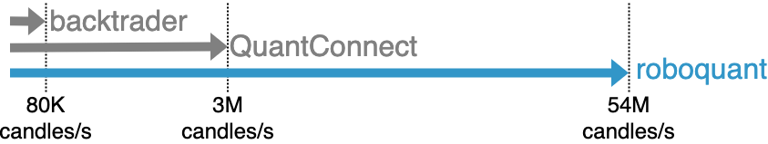

= Kotlin vs Python
:icons: font
:source-highlighter: rouge
:jbake-date: 2022-06-10
:jbake-heading: testing leads to failure, and failure leads to understanding
:intro: Before starting developing roboquant, we prototyped several solutions. If you want to find out why we settled on Kotlin, read this article.

== Why use Kotlin
There are many computer languages available to choose from. After having developed several prototypes in different languages (Python, Julia and Kotlin), we decided to go with Kotlin. Kotlin is a popular programming language that was first introduced in 2011 by JetBrains. It is a versatile language that is designed to be compatible with Java and can be used for a wide range of applications, including financial software.

There are several reasons why Kotlin is particularly suitable for financial software in general and algo-trading software in particular:

* [x] *High-Level Language*: Kotlin is a high-level language that is easy to read and understand, making it an ideal choice for developers working on complex financial applications. It has a concise and clear syntax that allows developers to write code quickly and efficiently.
* [x] *Interoperability with Java*: Kotlin is interoperable with Java, which means that developers can use existing Java libraries and frameworks in their Kotlin projects. This feature is particularly useful in financial software development, where many existing libraries are written in Java.
* [x] *Type-Safety*: Kotlin is a type-safe language, which means that it provides strong type-checking during the compilation process. This helps to eliminate common errors and bugs that can occur in software development.
* [x] *Null-Safety*: Kotlin has built-in null-safety features that help to prevent null pointer exceptions. In algo-trading software, where even a small error can have significant consequences, null-safety is essential.
* [x] *Concise Code*: Kotlin's concise syntax allows developers to write code more efficiently, reducing the amount of boilerplate code required. This helps to improve productivity and reduce the risk of errors. And perhaps equally important, it makes developing software much more fun.
* [x] *Strong Community Support*: Kotlin has a strong and growing community of developers who contribute to its development and offer support to others. This community provides a wealth of resources, including tutorials, libraries, and tools, making it easier for developers to create high-quality software.
* [x] *Fast Runtime*: Kotlin on a JVM is fast enough to handle even the largest data sets during back testing and allows for sub-millisecond market data processing. See also the xref:performance.adoc[performance page].
* [x] *Interactive Development*: You can use Kotlin in Jupyter Notebooks and interactively develop and test your trading strategies.

In conclusion, Kotlin is a versatile and powerful programming language that is well-suited for algo-trading software development.

== Why not use Python
One often heard question is "Why not use Python instead?" Truth be told, we would have loved to be able to use Python. However, during the prototype phase of _roboquant_, we discovered that the performance was lacking too much for our use-cases. In some scenarios, the performance was over 100x slower on multicore machines. This was including using libraries like Numpy and Pandas and even some Cython to speedup processing. One problem is that in back testing, many things cannot be vectorized, and these fast libraries like Numpy are no longer a good match.

When compared to popular other Python algo-trading frameworks like `backtrader`, the performance difference is even larger, with roboquant being over 500x faster.

The main reason for this lackluster performance is not only that Python is an interpreted language, but also the fact that it has a single threaded runtime that makes it difficult and inefficient to use all the cores found on modern CPU.

The good news is that if you really want to stick with Python, there are plenty of alternatives available. For example, you could have a look at backtrader, pyalgotrade or zipline. But we recommend giving _roboquant_ and Kotlin a try, and we are confident you will not regret that decision in the long term.

.Embed Python
****
It is possible to embed a Python interpreter within the JVM and use Python code to develop your strategies in _roboquant_. Right now this integration isn't yet included, and it requires more investigations to see what approach would work best. But it may be included in future releases, especially if it also opens up the Python ecosystem to _roboquant_.

An alternative to this is using GraalVM and leveraging their support for Python. This would enable a more seamless integration.
****