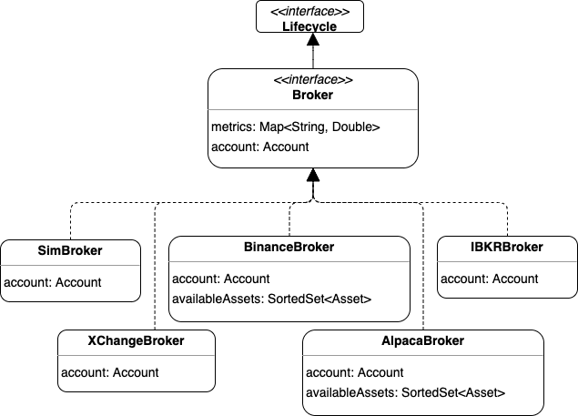

= Broker
:icons: font
:source-highlighter: rouge
:sourcefile: ../../samples/broker.kt
:jbake-date: 2020-08-01

== What is a broker
A broker receives orders and processes them. The outcome of this processing is an updated `Account`. There are two types of broker implementations:

1. SimBroker: simulates a broker and the trading that happens on an exchange.
2. Third party brokers: implementations that integrate with a real broker like IBKR, Alpaca or Binance.

These two types implement the same `Broker` interface. Normally during back-testing and live-testing you'll use the SimBroker, and during paper-trading and live-trading you'll use a real broker. The main method is `broker.place`. And although normally you wouldn't invoke it directly since the `Roboquant` instance would do that as part of a run, you can if you want to:

[source, kotlin,indent=0]
----
include::{sourcefile}[tag=basic]
----

WARNING: Broker implementations can differ in what order types and assets are supported. So when moving from the `SimBroker` to a real broker, always validate if the behavior is still as expected.

== Account
`broker.account` property returns an Account object. This `Account` object contains a snapshot of the exposed state of a broker and is identical between the simulated broker and real brokers. The object is guaranteed not to change, which also implies that if you want an updated version, you need to invoke `broker.account` again.

The `Account` object contains the following key properties:

- base currency of the account, used when converting a Wallet into a single-currency Amount
- total cash balance (represents the credit cash - loan value)
- the open positions
- trades that contain all the trade executions that have happened so far
- orders, both open orders and closed orders
- total amount of buying power available for trading (denoted in the base currency of the account)

TIP: Always use the `Account.buyingPower` property if you want to know how much money is remaining for trading. Especially when using a `MarginAccount`, you shouldn't rely on the `Account.cash` property, since that doesn't take into account any margin or leverage you might have.

Since properties like `trades` and `openOrders` of the account object are plain Kotlin collections, you can use standard Kotlin access patterns. Kotlin collections are very powerful tool to access data structures once you master them.

TIP: If you are new to Kotlin collections, you can go to this page for more info: https://kotlinlang.org/docs/collections-overview.html

Additionally, _roboquant_ defines several extensions that come in handy when dealing with the account object.

[source, kotlin,indent=0]
----
include::{sourcefile}[tag=account]
----

You can also print a `account.summary` or `account.fullSummary` overview. The full summary includes all positions, trades and orders, so it can become very large after an extensive back test:

[source,indent=0]
----
include::{sourcefile}[tag=fullsummary]
----

.Equity
****
Equity is a key metric to monitor if you want to see how your account is performing during a run. The following two equations hold true when running a back test:

[source, kotlin, indent=0]
----
include::{sourcefile}[tag=equity]
----
****

When you plot the equity curve in a Jupyter Notebook, you don't only can see the PNL performance, you also can see how smooth the curve is, providing an visual indication on the volatility of the returns of your strategy.

== Out of the box available brokers
The following `Broker` implementations are available:

See also xref:simbroker.adoc[SimBroker] and xref:integration.adoc[Integration] for more details on how to use these brokers.

