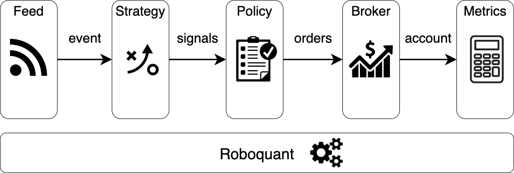

= Welcome
:icons: font
:sourcefile: ../../samples/index.kt
:source-highlighter: rouge
:jbake-date: 2020-12-01

== Why use roboquant
Developing and running algo-trading software is not an easy task at all. You already need additional skills, and on top of that, there is a lot of complexity involved that isn't perhaps clear from the beginning.

So it makes sense to separate the logic that is common to all automated trading strategies from the logic that is specific to your strategy.

== Main components
Perhaps the most important part of using _roboquant_ is to understand the sequence of steps and the responsibility each component has in this flow. The following diagram provides a logical overview of the main components and the type of data they consume and produce.

The role and responsibilities of the components are as follows:

* `Roboquant`
+
The engine of the platform that performs the actual run and orchestrates the interaction between the components. The engine supports all xref:../background/four_stages.adoc[4 stages] of developing a trading strategy with minimal changes to your code. This is also the only component that is a concrete `class` and not an `interface` and not designed to be swapped out for a custom implementation.

* `Feed`
+
Provides the data needed for testing and trading in the form of events. A feed can represent both historic and live data and is not restricted to pricing information only. A feed delivers its data in the form of events on a channel.

* `Strategy`
+
Receives the event and generates zero or more signals. A `Signal` is a `Rating` for a certain asset, like a BUY rating for stock XYZ. So the strategy doesn't create orders; that is the responsibility of the next component, the policy.

* `Policy`
+
Receives the generated signals and creates the actual orders. If you need to create orders that are not based on signals, this is also the place to do so, for example to re-balance your positions at regular intervals. Check in xref:../background/features.adoc#_order_management[features] why it is smart to separate this from your strategy logic.

* `Broker`
+
Receives the newly created orders by the policy and processes them. Any open orders received in previous steps will also be processed until they are closed. After the processing of the orders, it will return an updated account that reflects the latest state.

* `Metric`
+
Receives the latest state of the account and calculates various metrics that are of interest to determine the progress and results of the run so far. These results are then handed over to the `MetricsLogger` that will store and/or log the metric values, so you can inspect them at a later time.

== Implementation details
The actual implementation is a bit more elaborate. Especially the order of the components in the actual implementation might not be what you expected.

But there is a good reason it is done this way: it is now almost impossible to look into the future (look-ahead bias) with your strategy since the broker will always first observe a new event. So the signals and orders you create based on event at time t will only be processed by the broker based on an event at time t+1.

The following diagram shows the actual interactions with their real method names and parameters between the components.

image::main_flow.png[]

NOTE: Although the above diagram might look complicated, most of the complexity is handled by the Roboquant engine and when developing your own strategy you don't have to worry about it.

== Developing your own strategy
Developing a new strategy and validating it during a back-test is a straightforward process. The code snippet below shows the different steps that you have to take to develop and run your strategy.

[source, kotlin, subs="attributes,verbatim", indent=0]
----
include::{sourcefile}[tag=overview]
----
<1> Develop a new strategy based on some ideas you have. This can be done either from scratch or by assembling existing building blocks. In many cases, this is the only real software development required. See also xref:strategy.adoc[Strategy] for more details.
<2> Create an instance of your strategy.
<3> Instantiate the metrics you want to use to evaluate the performance of your strategy.
<4> Create an instance of Roboquant (the engine) with the strategy and metric(s) as parameters to the constructor.
<5> Pick the data feed you want to use to test your strategy.
<6> Run the back test using the data feed you just created.

The _roboquant_ platform is very flexible and provides many more options than the above example shows. You can easily change almost any aspect of the platform if the default behavior doesn't suit your needs.