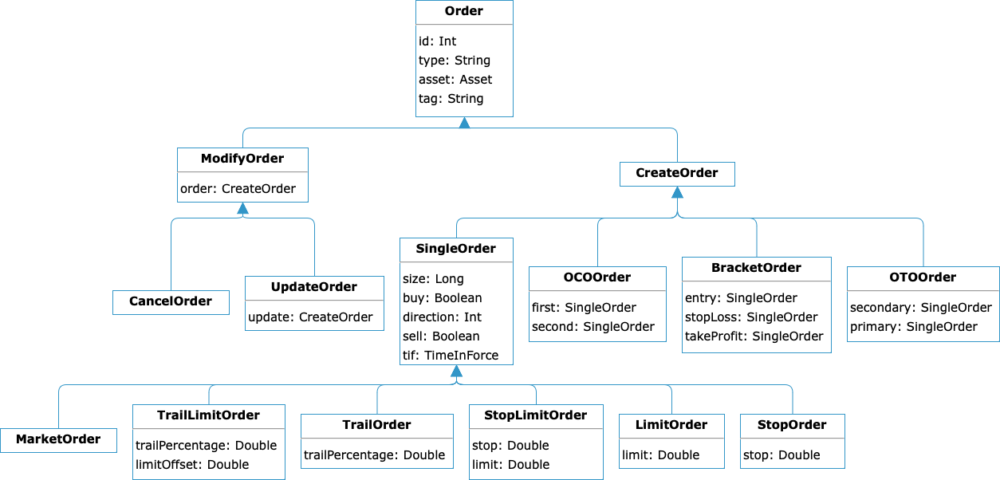

= Orders
:source-highlighter: rouge
:icons: font
:jbake-date: 2020-04-01
:sourcefile: ../../samples/orders.kt

== Order Types
Roboquant comes out of the box with support for different types of orders. All orders are a subclass of one of these two abstract classes:

1. `CreateOrder`: This represents a regular new order, for example a `MarketOrder` or `LimitOrder`. But also more complex order types like a `BracketOrder` are subclasses of the CreateOrder.
2. `ModifyOrder`: This modifies an existing open create-order. Right now there are two concrete subclasses: `UpdateOrder` and `CancelOrder`.

The following diagram shows the order types that are supported out-of-the-box and also their relationship to each other. The SimBroker supports all these order types, but other real `Broker` implementations might only support a subset.

See also the SimBroker section on xref:simbroker.adoc#_order_handling[order handling] for more details how orders are exactly processed.

****
An order always refers to a single asset, including advanced order types like BracketOrders. The reason for putting this restriction in place is that real brokers only have limited support for multi-asset orders, and this could lead to issues that are only discovered during live trading. Additionally, it makes back testing unpredictable if the price is only known for one of the assets.
****

== Creating Orders
The `Policy` used during a `run` is responsible for creating the orders. This can be based on the received signals from the `Strategy`, but can also be done for other reasons (like for example cyclic portfolio re-balancing).

An example on how to convert a list of signals into a list of (market) orders:

[source, kotlin,indent=0]
----
include::{sourcefile}[tag=orders]
----

NOTE: There is no explicit notion of BUY or SELL order in _roboquant_. A BUY order is just an order with a positive size and a SELL order has a negative size. But other than that, they are equal and created the same way.

Advanced order types are often constructed using multiple `SingleOrder` types. The following snippet shows how to instantiate a BracketOrder using three individual SingleOrders.

[source, kotlin,indent=0]
----
include::{sourcefile}[tag=bracketOrder]
----

TIP: During back testing make sure to only use order types that are also supported by the broker you plan to use for live trading. Also be aware that the way advanced order types are executed during live trading might differ slightly between brokers.

== TIF (Time In Force)
TIF sets an execution policy for an order, defining under what conditions the order remains valid. There are two types of TIF:

. Time based, defining how long the order remains valid. Two common ones are GTD (Good Till Day) and GTC (Good Till Cancelled)
. Fill based, defining under which fill conditions the order stays valid. A common one if FOK (Fill Or Kill)

The following diagram shows the time in force policies that are available out of the box:

image::tif.png[]

The default TIF for orders in _roboquant_, if none is explicitly specified, is GTC (Good Till Cancelled). All TIF policies only become active once an `CreateOrder` has been `ACCEPTED` (so it's not anymore in the `INITIAL` state).

== Custom Order Types
Orders can be extended with your own order types if the ones that come out-of-the-box are not sufficient. The steps required to use your own order types are:

. Extend one of the two `CreateOrder` or `ModifyOrder` abstract classes with your own order type
. If you want to use these orders also in back testing, you'll also need to implement and register an `OrderExecutor`. This is used by the `SimBroker` to simulate the executions of your order type.

After that, you can use this new order type in your policy just like any of the included order types.

[source, kotlin,indent=0]
----
include::{sourcefile}[tag=customOrder]
----

== Tracking Orders
After an order has been placed at a Broker, the state can be tracked via `Account.openOrders` or `Account.closedOrders`. It is important to realize that these two collections contain `OrderState` objects that wrap the original order that was placed at the broker.

Besides the underlying order, the `OrderState` object also contains the latest `OrderStatus` and timestamps when the order was accepted and closed.

[source, kotlin,indent=0]
----
include::{sourcefile}[tag=accountOrder]
----

== Own order logic
Although you typically would use an instance of `Roboquant` to handle method invocations on the various components, you can also invoke these methods directly from your own code.

For example, if you want to place a market order, you can directly invoke the `Broker.place` method:

[source, kotlin,indent=0]
----
include::{sourcefile}[tag=manualOrder]
----