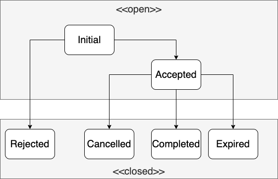

= Simulated Broker
:source-highlighter: rouge
:sourcefile: ../../samples/simbroker.kt
:jbake-date: 2020-08-01
:icons: font

You use the `SimBroker` class (short for Simulated Broker) both for the back testing and forward testing stages. See also the xref:../background/four_stages.adoc[four stages] for more background about the different stages when developing trading strategies.

SimBroker can simulate a wide range of brokers and exchanges. Besides several configuration parameters that are available, the behavior can be further extended by providing custom models for trading, fee and account modelling.

== Usage
The instantiation of a `SimBroker` is surprisingly simple if the default settings suit your needs:

[source,kotlin,indent=0]
----
include::{sourcefile}[tag=basic]
----

NOTE: This is also the configuration you get when you create an instance of `Roboquant` and don't specify a broker at all.

However, you can overwrite many of the default values. Common use cases are:

* you don't trade in USD but in some other currency
* you want to simulate a `MarginAccount` and not the default `CashAccount`
* you want to apply custom fees and pricing logic

So a more custom configured version of the SimBroker can be instantiated using:

[source,kotlin,indent=0]
----
include::{sourcefile}[tag=extra]
----

TIP: if you are trading specific markets, like FOREX, you most likely want to use customize the configuration since the default values like those selected for spreads are not representative for those types of markets.

The initial deposit is the cash that is deposited at the opening of an account. Any time the SimBroker is reset, the account will be reset to this initial deposit. Typically, the initial deposit is denoted in a single currency, like a *$50,000.00 USD* account. But this is not a hard requirement and with `SimBroker` you can use a multi-currency initial deposit if you prefer. However, there is always only one `baseCurrency`.

[#_order_handling]
== Order Execution
When an order is placed at the SimBroker, the following rules apply:

- create-orders only get executed if there is a known price for the underlying asset. Till an event occurs that has that price action available, the order will remain in its `INITIAL` state and will not be executed.

- modify-orders will always get executed, even if there is no known price for the asset.

- any TIF (Time In Force) enforcement of order execution will only start after an order has been accepted. So an order in `INITIAL` state will not expire, and time based TIF will only start counting after it has been accepted.

- modify orders will always be processed BEFORE create-orders. So if you send a `CancelOrder` and `MarketOrder` for the same asset, the `CancelOrder` is guaranteed to be processed first in the `SimBroker`.

- Create and modify-orders will be processed based on a FIFO (first-in-first-out) basis, so older orders are processed first.

- Once an order is closed, it cannot be opened again.

The following diagram shows the possible `OrderStatus` transitions:

== Customize SimBroker
Custom models are a way to further customize the `SimBroker` and ensure it closely mimics the behavior of your real broker.

WARNING: if you don't take any type of trading cost into account, your profitable strategy in back-test might turn out not to be that profitable in live trading. When in doubt, better to be on the safe side and configure the cost to be slightly higher than expected.

The following three types of models can be implemented if the default ones that come with _roboquant_ are not sufficient:

. `PricingEngine`: calculate the price to use for a trade. It can be used to simulate the following type of trading cost:
    - Spread (difference between the buy- and sell-price)
    - Slippage (large orders will require multiple trades against different prices)

. `FeeModel`: model the transaction-related fees and commissions. Trading cost to take into consideration:
    .. Broker commission fees
    .. Borrowing cost when shorting
    .. Storage & custodial fees
    .. Exchange fees and/or rebates

. `AccountModel`: calculate the available buying-power based on margins, open orders, cash and open positions.

Before implementing your own model, it is advised to check if the default-included models with their configuration options aren't sufficient. Below the available models with some examples of their configuration parameters:

[source, kotlin,indent=0]
----
include::{sourcefile}[tag=included]
----

== Limitations
Like any simulation, SimBroker also has limitations compared to live trading. It is important to realize this and take appropriate measures when possible:

1. The default cost calculations become less realistic if you trade large sizes compared to overall daily volume. As a rule of thumb: don't underestimate the additional costs like spread, slippage and commissions and better be on the safe side.
2. Order types might behave slightly different between SimBroker and different real brokers. If possible, perform extensive paper trading testing to see if your solution still performs as expected.
3. The buying power and margin calculations might differ. Again, be on the safe side and use higher margin requirements in the SimBroker than required by your actual broker.

== PricingEngine
The PricingEngine determines the price that is used for a trade execution. There are default ones included, but you can also easily implement your own:

[source, kotlin,indent=0]
----
include::{sourcefile}[tag=pricing]
----

== Account Models
Account models allow you to model the amount of **buying-power** for different types of accounts, like a Cash Account or Margin Account when using the SimBroker. Buying-power represents the amount of money available for trading.

Out of the box _roboquant_ comes with two account models that cater for the most common account types:

1. `CashAccount`; account that doesn't have any leverage or margin available.
2. `MarginAccount`; account that has (configurable) initial and maintenance margin requirements.

=== Cash Accounts
Cash accounts can be modelled using the `CashAccount`. This model is also the default if you don't provide a BuyingPowerModel when instantiating a xref:simbroker.adoc[SimBroker].

`CashAccount` bases the buying power only on the available cash, and no margin is calculated and no leverage is used. So cash and buying power are equal, however cash can contain multiple currencies while the buying power is always converted to the base currency of the account.

Although _roboquant_ doesn't stop you from using this model even when shorting assets, it is not advised to do so.

The below table shows an example using the default CashAccount when trading in different currencies, EUR and USD in this case.

[%autowidth, cols="^,<,>,>,>,>,>,>,>"]
|===
|Time |Action |Cash |Positions |Margin |Equity |Buying Power |Unrealized PnL |Realized PnL

|1 |open account with €10,000|€10,000|0|0|€10,000|€10,000|0|0
|2 |buy ABC 40 @ €100|€6,000|€4,000|0|€10,000|€6,000|0|0
|3 |price ABC drops to €75|€6,000|€3,000|0|€9,000|€6,000| -€1,000|0
|4 |sell ABC -40 @ €75|€ 9,000|0|0|€ 9,000|€9,000|0| -€1,000
|5 |buy XYZ 25 @ $200|€9,000 -$5,000|$5,000|0|€9,000|€4,500|0| -€1,000
|6 |price XYZ raises to $240|€9,000 -$5,000|$6,000|0|€9,000 $1,000|€4,500|$1,000| -€1,000
|7 |sell XYZ -25 @ $240|€9,000 $1,000|0|0|€9,000 $1,000|€9,900|0| -€1,000 $1,000
|===

=== Margin Accounts
Margin based accounts can be modelled using the `MarginAccount`. This model supports:

1. Initial margin (aka leverage)
2. Maintenance margin, with support for different values for long and short positions
3. Minimum amount of required equity that cannot be used as margin

All margin calculations are based on the equity of the account, and not just the cash. And although in the below tables the (maintenance) margin is shown, it is actually not exposed. Only the buying-power value is available through the account object.

The logic for calculating the buying power looks roughly like this in pseudocode:

[source,kotlin]
----
long_value = long_positions * maintenance_margin_long
short_value = short_positions * maintenance_margin_short
excess_margin = equity - long_value - short_value - minimum_equity
buying_power = excess_margin * ( 1 / initial_margin)
----

The following table shows an example for long trading with a margin account in the Japanese Yen, using the following (default) values:

- initial margin: 50%
- maintenance margin: 30% (both for long and short positions)
- no minimum equity is required

Also, there are no commissions or other costs associated with the transactions. This is not a recommended approach, but just used here to make it a bit simpler to comprehend.

[%autowidth, cols="^,<,>,>,>,>,>,>,>"]
|===
|Time |Action |Cash |Portfolio |Margin |Equity |Buying Power |Unrealized PnL |Realized PnL

|1 |open account with ¥1,000,000|¥1,000,000|0|0|¥1,000,000|¥2,000,000|0|0
|2 |buy ABC 500 @ ¥1,000|¥500,000|¥500,000|¥150,000|¥1,000,000|¥1,700,000|0|0
|3 |ABC drops to ¥500|¥500,000|¥250,000|¥75,000|¥750,000|¥1,350,000|-¥250,000|0
|4 |buy ABC 2000 @ ¥500|-¥500,000|¥1,250,000|¥375,000|¥750,000|¥750,000|-¥250,000|0
|5 |ABC drops to ¥400|-¥500,000|¥1,000,000|¥300,000|¥500,000|¥400,000|-¥500,000|0
|6 |sell ABC -2500 @ ¥400|¥500,000|0|0|¥500,000|¥1,000,000|0|-¥500,000
|===

The following table shows another example, but this time shorting on a USD margin account. It uses the same default values for the margin calculations as the above table.

[%autowidth, cols="^,<,>,>,>,>,>,>,>"]
|===
|Time |Action |Cash |Positions |Margin |Equity |Buying Power |Unrealized PnL |Realized PnL

|1 |open account with $20,000|$20,000|0|0|$20,000|$40,000|0|0
|2 |sell XYZ -50 @ $200|$30,000|-$10,000|$3,000|$20,000|$34,000|0|0
|3 |price XYZ raises to $300|$30,000|-$15,000|$4,500|$15,000|$21,000|-$5,000|0
|5 |sell XYZ -50 @ $300|$45,000|-$30,000|$9,000|$15,000|$12,000|-$5,000|0
|6 |buy XYZ 100 @ $300|$15,000|0|0|$15,000|$30,000|0|-$5,000
|===

=== Order impact on Buying Power
The following order-rules apply when calculating the buying power:

- Until an order is accepted (so in `INITIAL` state), it doesn't impact margin or buying power.
- Open orders that reduce a position size do not require buying power. So you can always close a position, both short and long positions.
- Once an order has been accepted, it will not be cancelled due to lack of buying power.
- An order in a closed state doesn't impact margin or buying power (so similar to the `INITIAL` state)

NOTE: Not all rules are currently implemented yet.

=== Margin Calls
A negative value for `BuyingPower` indicates a possible margin call situation. However, _roboquant_ doesn't interrupt the back-test for that.

If you are interested in detecting these conditions, best to configure a metric that logs the BuyingPower at each step and evaluate that metric after the run.

TIP: Always be very conservative about the amount of margin being available. Stay as far away from margin calls as possible, since these are typically manual broker processes that cannot be automated in an algo-trading strategy.

=== Realized profit
Open positions hold unrealized profit. As soon as a trade happens, some of this unrealized profit can become realized profit.

The following table shows the logic that is applied for long positions:

[%autowidth, cols=">,>,>,>,<"]
|===
|Position before|Trade|Position after|Realized PnL|Remark

|0|10 @ $104.0|10 @ $104.0| $0.0|Open position
|10 @ $100.0|-10 @ 104.0| 0 | $40.0|Close position
|10 @ $100.0| 10 @ 104.0| 20 @ $102.0 | $0.0|Increase position
|10 @ $100.0| -20 @ 104.0| -10 @ $104.0 | $40.0|Reverse position
|===

The same logic applies to short positions:

[%autowidth, cols=">,>,>,>,<"]
|===
|Position before|Trade|Position after|Realized PnL|Remark

|0|-10 @ $104.0|-10 @ $104.0| $0.0|Open position
|-10 @ $100.0|10 @ 104.0| 0 | -$40.0|Close position
|-10 @ $100.0| -10 @ 104.0| -20 @ $102.0 | $0.0|Increase position
|-10 @ $100.0| 20 @ 104.0| 10 @ $104.0 | -$40.0|Reverse position
|===

